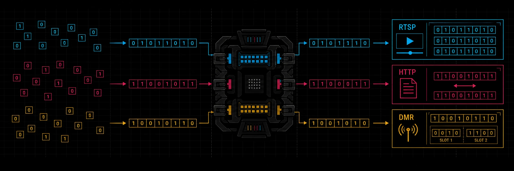

<p align="center">
  
</p>

<h1 align="center">bitsandbytes</h1>

<p align="center">
  <strong>One bit-native toolkit for Rust binary protocols.</strong><br>
  Turn raw bits into useful messages—and write them back without losing a thing.
</p>

<p align="center">
  
</p>

<p align="center">
  <a href="https://crates.io/crates/bitsandbytes"></a>
  <a href="https://docs.rs/bitsandbytes"></a>
  <a href="https://github.com/RawSocketLabs/rsl/actions/workflows/ci.yml"></a>
  
  
</p>

> Binary protocols do not stop at byte boundaries. Your codec should not either.

## Why bitsandbytes exists

Building a binary protocol in Rust often means assembling a narrow-integer crate, a
bitfield crate, enum conversions, a byte-oriented codec, and the glue between them.
That glue is where layouts get repeated, bit and byte order get confused, and a clean
RFC diagram turns into hand-written cursor math.

**bitsandbytes removes that seam.** It gives bit-sized values, integer-backed layouts,
and whole-message encoding one shared model—from a single flag to a streaming packet.

| Without bitsandbytes | With bitsandbytes |
|---|---|
| Several overlapping crates and conversion layers | One vocabulary for integers, fields, enums, flags, and messages |
| Byte cursors plus hand-written shifts at sub-byte boundaries | Read and write directly at arbitrary bit offsets |
| Layout rules repeated across parse and encode paths | One declaration generates both directions |
| Strict decoding or ad hoc escape hatches for unusual inputs | Construction-side validation, catch-all preservation, and raw escape hatches |

## The value in one glance

| | |
|---|---|
| ⚡ **Fast by construction**<br>Bitfields use shift-and-mask operations over a single backing integer—no bit-vector tax. | 🧩 **One coherent stack**<br>`u1`…`u127`, bitfields, enums, flags, builders, and `#[bin]` messages compose without adapters. |
| 🧭 **Order is explicit**<br>Bit order and byte order are independent knobs, matching the way real specifications describe a wire layout. | ↔️ **Bidirectional**<br>The same type reads and writes, from byte-aligned headers to fields that straddle byte boundaries. |
| 🧪 **Made for protocol work**<br>Correct-by-default builders coexist with permissive decoding for fuzzing, interop, and security research. | 🛡️ **Safe and portable**<br>The crate and generated code forbid `unsafe`; the core supports `no_std + alloc`. |

## A layout that looks like the spec

```rust
use bnb::{bitfield, u3, u4};

// Fields are declared in the same order as an MSB-first protocol diagram.
#[bitfield(u8, bits = msb, bytes = big)]
#[derive(Clone, Copy, Debug, PartialEq, Eq)]
struct Header {
    version: u3,
    kind: u4,
    urgent: bool,
}

let header = Header::new()
    .with_version(u3::new(2))
    .with_kind(u4::new(9))
    .with_urgent(true);

assert_eq!(header.to_be_bytes(), [0x53]);
assert_eq!(header.kind(), u4::new(9));
```

The same types nest directly inside `#[bin]` messages, where declarative directives
cover magic values, counts, context, conditionals, mapping, calculated fields,
reserved bits, alignment, positioning, and validation.

## One model, from one bit to a whole message

| Layer | Building blocks | What it handles |
|---|---|---|
| **Values** | `u1`…`u127`, `UInt<T, N>` | Exact-width unsigned integers |
| **Layouts** | `#[bitfield]`, `#[derive(BitEnum)]`, `#[bitflags]` | Packed fields, integer-backed enums, and flag sets |
| **Construction** | `#[derive(BitsBuilder)]` | Required-by-default, named-field builders |
| **Messages** | `#[bin]` | Declarative, bidirectional whole-message codecs |
| **I/O** | slices, streams, seekable readers, `BitBuf`, `bytes`, Tokio, sockets | The same message model across memory and transport boundaries |

## Quick start

The package is published as **`bitsandbytes`** and imported as **`bnb`**:

```sh
cargo add bitsandbytes --rename bnb
```

Or add it directly:

```toml
[dependencies]
bnb = { package = "bitsandbytes", version = "0.3.2" }
```

For `no_std + alloc`, disable the default `std` feature:

```toml
[dependencies]
bnb = { package = "bitsandbytes", version = "0.3.2", default-features = false }
```

Optional features add `bytes` adapters, Tokio codecs, standard socket helpers, and
in-memory mock transports without changing the core data model.

## Explore

- **[Crate overview and quick start](bnb/README.md)** — the practical API tour.
- **[Guided documentation](https://docs.rs/bitsandbytes/latest/bnb/guide/)** — runnable,
  doctested walkthroughs from numbers through full codecs.
- **[Examples](bnb/examples/README.md)** — DNS, IPv4, AIS, CAN signals, WAV, TLV,
  streaming, sockets, and more.
- **[Design rationale](bnb/DESIGN.md)** — why the codec is owned, bit-native, and
  dual-use.
- **[Road to 1.0](bnb/ROADMAP.md)** — capability status and the remaining stability work.

## Project status

bitsandbytes is feature-complete and already dogfooded across real protocol
implementations, but remains pre-1.0 while its public API earns a long-term SemVer
commitment. The test suite includes golden wire vectors, property-based round trips,
compile-fail diagnostics, arbitrary-input robustness checks, and fuzzing.

The workspace contains two independently published crates:

| Crate | Path | Role |
|---|---|---|
| `bitsandbytes` (imported as `bnb`) | [`bnb/`](bnb/) | Runtime types, traits, I/O, and macro re-exports |
| `bitsandbytes-macros` | [`bnb-macros/`](bnb-macros/) | Procedural macro implementation |

## Contributing, security, and license

Contributions are welcome through [issues and pull requests](https://github.com/RawSocketLabs/rsl).
Please report vulnerabilities through [GitHub's private vulnerability reporting](https://github.com/RawSocketLabs/rsl/security/advisories/new).

bitsandbytes is dual-licensed under [MIT](../LICENSE-MIT) or
[Apache-2.0](../LICENSE-APACHE), at your option.
