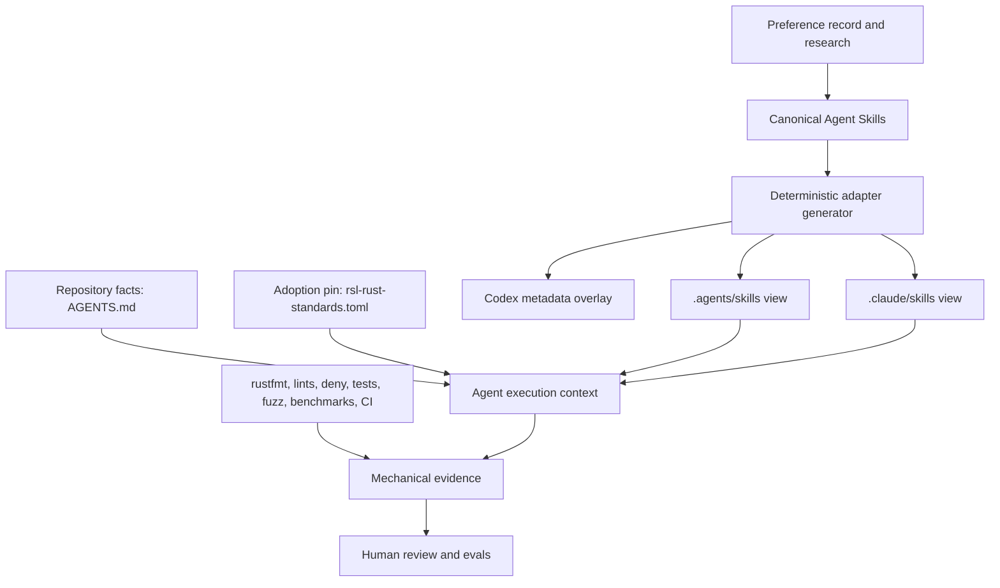

# Rust Engineering Standards System: Architecture Proposal

Status: bounded Stage 3 implementation approved and completed; independent
baseline-versus-skill runs and publication acceptance remain pending

Date: 2026-07-18

Inputs:

- [Preference record](preference-record.md)
- [Research report](research-report.md)

## Recommendation

Build a Markdown-first standards repository with two initial, self-contained
Agent Skills, a small repository-adoption declaration, human-authored
`AGENTS.md` instructions, deterministic adapter generation, and an eval harness.

The first implementation should contain only:

- `rsl-rust-core`;
- `rsl-rust-review`;
- a root and nested `AGENTS.md` template;
- an `rsl-rust-standards.toml` adoption schema;
- adapter generation and drift validation; and
- baseline-versus-skill eval fixtures.

Do not implement `rsl-rust-systems`, `rsl-rust-protocol`, or `rsl-rust-dsp`
until the core and review skills demonstrate value in evals and at least one
pilot repository. Do not introduce a general rule compiler in the initial
version.

The requested refinement rounds for testing standards, examples, and
nonmechanical code style are complete and incorporated below.

## Goals

The system should:

1. Preserve the owner's engineering priorities and tradeoff preferences without
   turning them into context-free absolutes.
2. Give agents a small, reliable decision process for implementing and reviewing
   Rust.
3. Keep repository facts close to the repositories they describe.
4. Put mechanically checkable rules in Rust tooling and CI.
5. Work predictably in Codex, Claude Code, Cursor, and Zed.
6. Make exceptions explicit, local, and reviewable.
7. Permit pre-1.0 evolution while making breaking changes visible through
   Conventional Commits.
8. Provide evidence that a skill improves results compared with no skill or the
   previous version.
9. Remain an independently versioned, relocatable bundle while canonically
   hosted beneath the RSL repository.

## Non-goals

The first implementation should not:

- replace rustfmt, Clippy, cargo-deny, rustdoc, tests, fuzzers, benchmarks, or CI;
- prescribe one architecture for every Rust repository;
- reproduce the Rust book, standard library documentation, or lint catalog;
- silently add or update dependencies;
- encode every draft preference into an always-loaded prompt;
- guarantee identical vendor behavior through file layout alone;
- generate repository facts by guessing them from source code; or
- create domain skills before their boundaries and eval value are established.

## System layers



The arrows do not imply that preference and research documents are loaded during
ordinary agent work. They are design provenance. Agents consume the concise
skills, repository facts, and tool results.

### Layer 1: Canonical skills

Canonical skill packages are valid Agent Skills stored under `skills/`. They are
human-readable and can be tested directly by path. Each package is flat and has
a globally unique `rsl-`-prefixed name.

The canonical packages contain no product-specific frontmatter or behavior.
Their `agents/openai.yaml` files contain UI metadata produced by the official
skill scaffold, not engineering rules; generation copies that metadata into the
Codex views. Other product extensions are generated into adapter views.

### Layer 2: Repository facts

`AGENTS.md` is the canonical human-authored repository instruction file. It
contains facts, commands, boundaries, adopted profiles, local choices, and
exceptions. Nested files contain only subtree-specific facts or overrides.

Claude receives a generated `CLAUDE.md` import adapter. Cursor and Zed receive
compatibility checks because their instruction discovery can be affected by
other files.

### Layer 3: Adoption declaration

`rsl-rust-standards.toml` pins the standards version and selects profiles and
skills. It is routing metadata, not a second copy of repository instructions.
Detailed commands, targets, budgets, and exceptions remain in `AGENTS.md`, Cargo
manifests, tool configuration, or CI.

### Layer 4: Mechanical enforcement

Rust and CI tooling own facts that can be checked deterministically. Skills tell
the agent which evidence to seek and how to interpret it; they do not copy the
tool's rule catalog.

### Layer 5: Evals and human review

Evals measure trigger quality, instruction precedence, decision quality,
verification discipline, and context cost. Human review owns qualitative
judgment and any policy change.

## Implemented repository layout

```text
rust-skills/
├── .cargo/config.toml                 # cargo xtask alias
├── README.md
├── LICENSE-APACHE
├── LICENSE-MIT
├── Cargo.toml                         # independent xtask workspace
├── Cargo.lock
├── docs/
│   ├── preference-record.md
│   ├── research-report.md
│   ├── architecture-proposal.md
│   ├── source-ledger.md               # provenance for adapted material
│   ├── authoring-conventions.md
│   ├── adoption.md
│   └── evaluation-guide.md
├── skills/
│   ├── rsl-rust-core/
│   │   ├── SKILL.md
│   │   ├── agents/openai.yaml         # UI metadata only
│   │   └── references/
│   │       ├── profiles-and-priorities.md
│   │       ├── api-ownership-and-errors.md
│   │       ├── dependencies-and-change.md
│   │       ├── verification.md
│   │       ├── documentation-and-examples.md
│   │       └── style.md
│   └── rsl-rust-review/
│       ├── SKILL.md
│       ├── agents/openai.yaml         # UI metadata only
│       └── references/
│           ├── review-procedure.md
│           └── risk-checks.md
├── templates/
│   ├── AGENTS.root.md
│   ├── AGENTS.nested.md
│   ├── CLAUDE.md.template
│   └── rsl-rust-standards.toml
├── evals/
│   ├── core/
│   ├── review/
│   ├── discovery/
│   └── precedence/
├── crates/
│   └── xtask/                         # std-only generator and validators
└── generated/
    ├── agent-skills/                  # .agents/skills install view
    ├── claude-skills/                 # .claude/skills install view
    ├── codex-overlay/                 # agents/openai.yaml additions
    └── manifest.toml                  # source version and hashes
```

The initial names and boundaries are implemented. Testing, example, and style
refinement showed that verification, documentation/examples, and nonmechanical
style have different loading conditions, so they use separate references.

Do not put a README, installation guide, changelog, or process narrative inside
an individual skill. Repository-level documentation may describe development and
distribution; skill packages should contain only runtime instructions and
resources.

## Distribution and RSL integration

The canonical source now lives at `tools/rust-skills` in the RSL repository.
Treat the directory as an independently versioned standards bundle: publish
namespaced tags such as `rust-skills-v0.1.0`, and keep its canonical files,
validation, generation, and tests operable both in the monorepo and when the
directory is exported as a standalone bundle.

Apply these constraints from the first implementation:

- Resolve internal resources relative to the standards repository or selected
  skill package. Do not embed machine-specific paths or assume a particular
  parent checkout layout.
- Keep the standards tooling in its own Cargo workspace boundary. It must not
  become a member of RSL's root Cargo workspace or inherit its dependency graph.
- Keep canonical skills under `skills/`, outside product auto-discovery roots.
  Merely checking out RSL must not silently activate every skill.
- Install or generate only the selected adapter view into the consuming
  repository's discovery locations. The adoption declaration must continue to
  pin an exact standards release or commit.
- Make validation and generation callable from any working directory with an
  explicit standards-source path or manifest path.
- Test both exported-standalone and nested-under-RSL layouts before the first
  pilot is considered portable.

Do not introduce a submodule or second canonical repository. External consumers
may pin a namespaced RSL tag, an exact RSL commit, or a release archive produced
from the tagged directory. The delivery choice must not change skill content or
make a consumer repository the implicit source of truth.

## Skill boundaries

### `rsl-rust-core`

Purpose: guide implementation and modification of Rust code under the owner's
general engineering priorities and the adopting repository's selected profile.

The body should remain a short workflow:

1. Discover applicable instructions, adoption metadata, manifests, nearby code,
   tests, and history.
2. Identify repository profile, domain, trust boundary, hot paths, and local
   constraints.
3. Make the smallest correct design that keeps misuse difficult and complexity
   justified.
4. Load only the reference topics implicated by the change.
5. Implement without unrelated cleanup.
6. Run baseline verification and risk-specific evidence.
7. Self-review the diff and report what ran, what did not, and why.

Core references should contain the cross-cutting rules that an agent is likely to
miss or misapply. They should not contain full protocol or DSP standards.

The core description should trigger for material Rust implementation, refactor,
API, dependency, concurrency, unsafe, testing, and documentation changes. It
should not trigger for a simple request to explain a Rust syntax fragment or to
edit unrelated non-Rust artifacts.

### `rsl-rust-review`

Purpose: review a Rust diff, branch, commit, or design for correctness and
regression risk under the same repository profile.

Review is separate from core because it has a different output contract and
failure mode. It should:

- inspect applicable repository instructions before judging the change;
- lead with actionable defects, ranked by consequence and confidence;
- attach evidence to exact files or behavior;
- distinguish correctness defects from optional improvements;
- look for API, ownership, panic, allocation, concurrency, unsafe, protocol,
  numeric, documentation, and scope regressions as applicable;
- avoid inventing findings to satisfy a checklist; and
- summarize verification gaps only after findings.

The review skill should be self-contained. It may require `rsl-rust-core` to be
installed as part of an adoption set, but it must not use sibling-file references
that break when a skill is distributed independently. Its compact risk checklist
may overlap with core at the category level; detailed rule duplication should be
avoided.

### Deferred domain skills

#### `rsl-rust-protocol`

Candidate scope: protocol authority, hostile input, framing, incomplete versus
malformed input, unknown/reserved values, `bitsandbytes`, verbatim/canonical
encoding, integrity/correction, and protocol-focused tests.

Create it only after protocol evals show that core references are insufficient.
Where `bitsandbytes` is adopted, its current API and vocabulary take precedence
over a generic validation abstraction.

#### `rsl-rust-dsp`

Candidate scope: domain quantities, owned buffers, streaming contracts,
discontinuities, numeric equivalence, rate changes, hot-loop allocation,
architecture fallbacks, SIMD evidence, and observability.

#### `rsl-rust-systems`

Candidate scope: sync/async boundaries, bounded queues, overload, lifecycle,
atomics, unsafe, FFI, and platform behavior.

This boundary is the least certain. If evals show that concurrency, unsafe, and
FFI trigger independently, keep them as core references or split the proposed
skill rather than creating an incoherent “systems” bucket.

## Profiles

Profiles describe default tradeoffs. Domain skills describe specialized
reasoning. They are separate dimensions.

The initial profile set should be:

| Profile | Intended use | Default emphasis |
|---|---|---|
| `public-library` | Public or broadly reused libraries | Misuse resistance, documentation, conventional APIs, typed errors, few entry points, compatibility awareness |
| `internal-library` | Targeted reusable domain libraries | Domain precision, focused implementations, expert-facing controls, measured performance |
| `performance-application` | Applications with sustained throughput or latency constraints | Business clarity plus explicit hot paths, bounded memory, overload policy, reproducible performance evidence |
| `pragmatic-application` | Applications optimizing for readable behavior and delivery | Clear business logic, maintainability, direct solutions, targeted rather than pervasive optimization |
| `prototype` | Experiments and exploration | Flexibility and velocity, while retaining memory safety and non-panicking hostile-input boundaries |

A repository selects one default. A workspace component may override it when the
reason and scope are explicit. Domains are selected separately from `protocol`,
`dsp`, and `systems` once those skills exist.

Security sensitivity, hostile input, unsafe code, FFI, and hot paths are local
risk declarations, not profiles. Treating them as facts avoids forcing a whole
repository into one extreme posture.

## Rule representation

The first version should use structured Markdown, not a compiled DSL. Group
related rules into reference files rather than creating hundreds of tiny files.

Use a stable form such as:

```markdown
### CORE-API-001 Preserve important invariants in types

- Strength: SHOULD
- Applies to: public and internal libraries
- Directive: Use a domain type when confusing two values would create a
  meaningful correctness defect.
- Rationale: The type should make the domain legible and prevent accidental
  interchange without obscuring simple code.
- Exceptions: Keep a primitive when the distinction is local, obvious, and
  conversion noise would dominate the API.
- Mechanical owner: Clippy cannot decide this; review and evals own it.
- Sources: Rust API Guidelines; preference record R11.
```

Required metadata:

- stable rule ID;
- normative strength;
- applicable scope/profile;
- directive;
- rationale;
- explicit exception or statement that local instructions own exceptions;
- mechanical owner, if any; and
- source or owner-decision provenance.

Normative terms retain their agreed meaning:

- **MUST:** required unless a higher-precedence instruction explicitly overrides
  it; safety and correctness invariants should dominate this class.
- **SHOULD:** expected default; deviation requires a concrete reason.
- **PREFER:** choose when tradeoffs are otherwise comparable.
- **CONSIDER:** prompts evaluation; it does not presume the result.
- **MAY:** allowed option, not a recommendation.

The validator may parse headings and fields to catch missing IDs or metadata, but
generation should initially copy Markdown rather than transform rule semantics.

## Repository adoption declaration

Use `rsl-rust-standards.toml` at the repository root:

```toml
schema = 1
standards = "0.1.0"
profile = "public-library"
skills = ["rsl-rust-core", "rsl-rust-review"]

[components."crates/protocol"]
profile = "internal-library"
domains = ["protocol"]

[components."apps/shrike"]
profile = "performance-application"
domains = ["dsp", "systems"]
```

Only routing and pinning belong here:

- schema version;
- exact standards release or commit pin;
- default profile;
- selected skills; and
- optional component profile/domain overrides.

Do not duplicate MSRV, targets, commands, protocol revisions, queue capacities,
or performance budgets in this file. Those values already have canonical homes
in Cargo, CI, specifications, benchmark configuration, or `AGENTS.md`.

If a repository does not adopt the declaration, skills may still be used
globally, but they must infer no profile silently. They should identify the
repository's apparent class, state the assumption, and make conservative,
confined choices.

## `AGENTS.md` contract

### Root template

The root template should ask maintainers to fill only relevant sections:

1. Scope and repository map.
2. Standards pin, default profile, and adopted domain skills.
3. Canonical build, format, lint, test, docs, fuzz, benchmark, and profiling
   commands.
4. Dependency policy, including `rsl-deps` adoption and approval rules.
5. MSRV and first-class targets.
6. Architecture and ownership boundaries.
7. Trust boundaries and authoritative protocol specifications.
8. Hot paths, performance budgets, and allocation constraints.
9. Queue overload, lifecycle, and shutdown policy when concurrency exists.
10. Unsafe and FFI locations and their verification commands.
11. Documentation, examples, generated-code, fixture, and changelog rules.
12. Local exceptions with scope and rationale.

Omit irrelevant sections rather than filling them with generic text.

### Nested template

A nested instruction file should contain only:

- its subtree scope;
- changed commands or facts;
- adopted component profile/domain;
- overrides with rationale; and
- a pointer to the root instructions.

Do not repeat the root file. A validator should flag exact duplicated blocks and
unscoped override language.

### Instruction precedence

The templates should state the logical order explicitly:

1. current user instruction;
2. closest repository-local instruction;
3. parent/root repository instruction;
4. repository-declared domain skill;
5. general Rust skill; and
6. general agent behavior.

Material conflicts must be surfaced. A lower layer may strengthen an
unconstrained rule but not silently reverse a higher choice.

## Adapter architecture

### Generated views

The generator should produce installable views from canonical packages:

- `.agents/skills` for Codex, Cursor, and Zed;
- `.claude/skills` for Claude Code;
- Codex `agents/openai.yaml` metadata in the generated Codex view; and
- a minimal `CLAUDE.md` template that imports `AGENTS.md`.

Adapter output should include:

- canonical source path;
- standards version or commit;
- generator version;
- content hash; and
- a “generated; do not edit” marker.

Commit generated outputs and run generation in `--check` mode in CI.

### Coexistence gate

Cursor currently documents that it scans both `.agents/skills` and
Claude-compatible `.claude/skills`, but its public skill documentation does not
specify same-name deduplication or precedence across those roots. Therefore the
initial generator must not claim safe simultaneous installation until an actual
Cursor conformance fixture verifies the current behavior.

The implementation should support explicit install profiles:

- `common`: `.agents/skills` for Codex/Cursor/Zed;
- `claude`: `.claude/skills` plus `CLAUDE.md` import; and
- `multi-agent`: emitted only after duplicate-name behavior passes a pinned
  Cursor version test or the adapter has a verified nonduplicating strategy.

Do not solve this by silently renaming Claude skills, disabling automatic
invocation, or installing both roots and hoping Cursor chooses correctly. Those
approaches change trigger semantics or leave an undocumented conflict.

### Zed instruction gate

Zed uses the first matching project instruction filename and checks `.rules`
before `AGENTS.md`. Adoption must detect `.rules`, `.cursorrules`,
`.windsurfrules`, `.clinerules`, Copilot instructions, `AGENT.md`, `CLAUDE.md`,
and `GEMINI.md`. If an earlier file would mask canonical `AGENTS.md`, stop and ask
the maintainer whether to migrate, consolidate, or explicitly retain it.

### Claude adapter

The generated wrapper should remain minimal:

```markdown
@AGENTS.md
```

Claude-specific additions belong below the import only when a repository has a
real Claude-only requirement. They should not restate Rust standards.

## Generator and validation tooling

Use a small std-only Rust `xtask` unless implementation research reveals a
material portability problem. Rust is already present in target repositories,
and a std-only tool avoids adding a scripting-language dependency or third-party
crate graph.

Proposed commands:

```text
cargo xtask validate
cargo xtask generate
cargo xtask generate --check
cargo xtask inspect-adoption /path/to/repo
cargo xtask install --agent common|claude|multi-agent --scope repo|user
```

No command may overwrite an existing instruction or skill file without showing
the exact target and requiring an explicit replacement choice. Installation
should stage into a temporary directory, validate it, then copy individual
validated targets.

Static validation should cover:

- valid Agent Skills names and frontmatter;
- globally unique names;
- flat package layout;
- reference links and one-level reference depth;
- rule IDs, normative strengths, and required metadata;
- source-ledger entries for adapted material;
- generated hashes and drift;
- adoption schema and known profiles;
- duplicate target skill names;
- Zed masking instruction files; and
- multi-agent Cursor coexistence status.

## Mechanical enforcement baseline

The initial templates should route the following to tools:

| Concern | Default mechanism |
|---|---|
| Formatting | stable rustfmt |
| Lints | workspace `[lints]`, `clippy::all`, curated individual additions |
| Warnings | denied in pinned CI; local behavior declared by repository |
| Dependencies | Cargo features plus owner discussion; prefer `rsl-deps` when adopted |
| Supply chain | cargo-deny with repository license/advisory/source policy |
| MSRV | exact `rust-version`, pinned MSRV job, current stable job |
| Documentation | rustdoc, doctests, public-doc lint policy |
| Correctness | risk-selected tests, meaningful feature matrix, semantic assertions |
| Hostile inputs | reproducible fuzzing, no-panic assertions, minimized regressions |
| Unsafe/FFI | deny by default, scoped allowances, Miri/sanitizers/fuzz/platform tests |
| Semver | Conventional Commits and semver checks where the repository adopts them |
| Performance | local benchmarks/profiles with controlled CI only where stable |

The exact curated lints, example requirements, and style preferences remain open
for the requested refinement rounds.

### Testing policy after refinement

Keep the core skill's testing workflow compact: identify the changed contract,
select evidence by risk, run the repository's declared default tier, add
risk-specific tiers, and report omissions. Detailed testing rules belong in the
verification reference and repository templates rather than the always-loaded
skill body.

The root `AGENTS.md` template should ask repositories to map applicable `fast`,
`default`, `extended`, `adversarial`, and `performance` tiers to commands and to
declare meaningful Cargo feature configurations, native platform jobs, fuzz
cadence, corpus storage, and controlled performance runners. Mechanical tooling
and CI own coverage collection, feature-matrix execution, snapshot drift, retry
behavior, and scheduled campaigns. Coverage is diagnostic by default; focused
thresholds or mutation testing require a repository-local risk justification.

Reusable conformance suites should cover implementations that promise the same
behavior, including scalar and optimized kernels. Important static misuse
contracts receive compile-fail tests without overspecifying compiler wording.
Correctness fixes retain minimized regression cases, including failures
discovered by fuzz or property testing. Cross-compilation is build evidence, not
a substitute for native execution on first-class platforms.

Testing dependencies follow the ordinary approval policy and prefer approved
`rsl-deps` capabilities when available; the standards system does not select a
universal crate stack. Tests for bounded systems should exercise resource,
backpressure, cancellation, and shutdown limits with generated data and injected
controls before resorting to large fixtures.

Implementation and review evals should detect common policy failures: exposing
an API only for tests, asserting incidental error text, accepting a flaky test by
retry, silently updating golden output, or treating exhaustive feature powerset
testing as a substitute for risk analysis.

### Example policy after refinement

Put detailed example guidance in `documentation-and-examples.md`, loaded when a
change creates or materially edits public documentation, rustdoc code, or an
`examples/` target. The core workflow needs only to recognize examples as public
API consumers that require verification.

Every `examples/` target must state a concrete user-facing use case and remain
distinct from tests: it teaches a workflow, whereas tests establish exhaustive
or regression evidence. Item and module rustdoc own narrower teaching. Examples
compile under their real features, model fallible non-panicking use, expose
material operational costs, and progress from the common path to advanced
controls.

Protocol examples teach valid construction before explicit invalid-message
escape hatches. DSP examples begin with deterministic hardware-independent data
and isolate radio-specific integration. CI should compile or transparently derive
substantial code so documentation cannot drift without making its source opaque.

Example sources use task-oriented names and state their purpose, prerequisites,
canonical Cargo invocation, expected behavior, and intentional omissions. They
use production-shaped public APIs, keep dependencies and features explicitly
gated, and fail actionably around external resources. A few illustrative
assertions are acceptable, but regression coverage remains in tests and
performance comparisons remain in benchmarks. API changes update affected
examples in the same change, and redundant targets are consolidated rather than
kept to meet a quota.

### Style policy after refinement

Put nonmechanical style judgment in `style.md`; rustfmt and curated Clippy policy
remain the source of truth for mechanically enforceable formatting and lints.
Load the style reference when writing or materially restructuring Rust, or when
reviewing code whose control flow and organization affect clarity. Do not turn
preferences into blocking findings when a repository-local convention or a
clearer domain-specific form justifies a different choice.

The initial style defaults favor `match` for structured and exhaustive domain
branching while retaining `if` for direct predicates. Guard clauses and
`let ... else` keep successful paths flat. Short combinator chains are welcome,
but explicit control flow wins when it reveals business rules, errors, state, or
ownership. Function boundaries follow concepts rather than line limits;
mutation, shadowing, names, modules, imports, and public re-exports should make
domain meaning locally visible.

Owned enum matches remain meaningfully exhaustive, while open external domains
and preserved unknown values retain explicit fallbacks. Error propagation stays
structured; iteration form follows actual control flow; and cloning makes shared
ownership visible. Comments preserve durable reasons, not syntax. Macros require
significant value beyond ordinary Rust abstractions. Unsafe proof obligations,
visibility, and lint exceptions stay narrow and locally explained.

## Evaluation architecture

### Eval classes

1. **Trigger evals:** confirm core/review activates for relevant Rust work and
   stays dormant for unrelated or trivial questions.
2. **Decision evals:** compare no-skill and with-skill designs for ownership,
   API, errors, dependencies, scope, and evidence.
3. **Review evals:** use seeded diffs with real and tempting-but-false findings.
4. **Precedence evals:** place conflicting root/nested/profile instructions and
   confirm the closer rule wins and the conflict is reported when material.
5. **Discovery evals:** verify each product's actual install paths and same-name
   behavior.
6. **Cost evals:** record context/tokens, time, tool calls, and unnecessary work.
7. **Regression evals:** compare a release candidate with the last published
   skill version.

### Case format

Each case should contain:

- realistic user prompt;
- minimal fixture repository or diff;
- applicable agent/product version;
- expected behavior in human-readable terms;
- objective assertions where possible;
- forbidden behaviors;
- baseline and skill output locations;
- timing/token metadata when available; and
- human-review notes.

Do not place the desired answer in the task context. Graders receive assertions
after the run. Prefer mechanical graders for files, compilation, tests, and
structured output; use blind human or model comparison for design quality.

### Initial acceptance gate

Before publishing either initial skill:

- all static validators pass;
- trigger false positives and false negatives are reviewed;
- the skill materially improves at least the high-risk assertions over baseline;
- no critical assertion regresses relative to baseline;
- context and execution cost are recorded;
- at least one realistic RSL fixture is included without leaking private data;
- adapter discovery is confirmed on supported products or explicitly marked
  unverified;
- generation and validation pass from standalone and nested-under-RSL fixture
  layouts; and
- the owner reviews the actual paired outputs, not only aggregate scores.

## Versioning and change policy

Use Conventional Commits from the first commit. Before `1.0.0`, breaking changes
are allowed but must be explicit.

Suggested interpretation:

- `fix:` corrects a rule, adapter, validator, or eval without deliberately
  changing the supported contract;
- `feat:` adds a compatible rule, profile, reference, eval, or adapter feature;
- `feat!:` or another `!` commit changes rule meaning, profile behavior, schema,
  discovery, or generated layout incompatibly;
- `docs:` changes design provenance or repository documentation without changing
  skill behavior; and
- `test:` changes eval coverage without changing intended behavior.

Use stable rule IDs. Do not recycle a removed ID for a new meaning. Adoption pins
an exact release or commit; updates show semantic changes and regenerated adapter
diffs for review.

## Adoption workflow

For each pilot repository:

1. Inspect existing instructions, skills, Cargo configuration, CI, commands,
   profiles, targets, trust boundaries, and product compatibility files.
2. Choose a default profile and any component overrides.
3. Create the minimal adoption declaration.
4. Fill the root `AGENTS.md` template with verified facts; preserve stronger
   repo-specific rules.
5. Add nested instructions only where a real subtree difference exists.
6. Select an agent install profile; do not emit multi-agent adapters until the
   coexistence gate passes.
7. Configure or preserve mechanical enforcement.
8. Run static validation and discovery smoke tests.
9. Run representative implementation and review evals.
10. Present local exceptions, unresolved gaps, and adjacent improvements to the
    owner before declaring adoption complete.

The first pilots should be small enough to inspect fully but representative of
different profiles. A likely later pair is one `bitsandbytes` protocol component
and one DSP/Shrike-related component, but pilot selection remains an owner
decision.

## Staged implementation after implementation approval

### Stage 2A: preference refinement

Conduct focused interviews for:

- testing standards (complete);
- example standards (complete); and
- code style beyond rustfmt/Clippy, including `match` versus `if` (complete).

Update the preference record and architecture only where these decisions affect
boundaries or enforcement.

### Stage 3A: repository foundations (complete)

- Add dual license files.
- Add the source ledger.
- Add the minimal adoption schema and templates.
- Scaffold the std-only `xtask` and static validation.

### Stage 3B: initial skills (complete)

- Initialize `rsl-rust-core` and `rsl-rust-review` using the skill-creation
  tooling.
- Write concise bodies and only the references proved necessary by examples and
  evals.
- Generate target metadata and adapter views.

### Stage 3C: eval foundations (complete)

- Add trigger, decision, review, precedence, and discovery fixtures with prompts
  isolated from graders.
- Validate fixture metadata and keep run artifacts out of task context.
- Establish independent no-skill baselines before tuning or publishing; live
  baseline-versus-skill runs remain an acceptance activity, not fabricated
  implementation output.

### Stage 4: pilot adoption

- Adopt in one repository/component.
- Record friction, false triggers, missing facts, and rule conflicts.
- Revise before broader rollout.

### Stage 5: domain skills

Create protocol, DSP, or systems skills only when pilot evidence identifies a
coherent trigger and repeated missing reasoning that core cannot economically
provide.

## Alternatives considered

### One giant Rust skill

Rejected because it loads irrelevant material, creates conflicts across profiles,
and makes triggering and eval attribution poor.

### Hundreds of single-rule skills

Rejected because catalog metadata and trigger overlap would dominate context and
same-name/discovery behavior would become difficult to reason about.

### A rich YAML rule DSL compiled into skills

Deferred. It could improve composition later, but it adds a second language,
compiler semantics, and generated-debugging burden before duplication is proven.

### Put all standards in `AGENTS.md`

Rejected because it mixes reusable judgment with repository facts, consumes
always-on context, and makes cross-repository updates difficult.

### Tool-specific hand-maintained copies

Rejected because drift is already visible in reviewed repositories and product
precedence differs. Generated views are inspectable without becoming separate
sources of truth.

### Symlink every adapter

Rejected as the default because platform and product behavior differs and some
adoption contexts require generated metadata. Symlinks may be permitted by a
specific repository, but the portable workflow does not depend on them.

## Approval recorded

On 2026-07-18, the owner approved the following architecture choices:

1. Use `rsl-`-prefixed skill names.
2. Start with only core and review skills.
3. Use `rsl-rust-standards.toml` only for routing and version pinning.
4. Keep repository facts in human-authored `AGENTS.md` files.
5. Use a std-only Rust `xtask` for validation, generation, and installation.
6. Commit generated adapter views and verify drift in CI.
7. Treat simultaneous `.agents/skills` plus `.claude/skills` installation as
   blocked until Cursor duplicate behavior is verified.
8. Complete testing, examples, and style refinement before writing final skill
   content.
9. Preserve the standards component as a relocatable, independently versioned
   bundle canonically hosted at `tools/rust-skills` in RSL.

Approval authorizes Stage 2A refinement, not automatic implementation of Stage
3. Implementation begins only after the refinement record and any resulting
architecture changes are reviewed.

## Stage 3 implementation approval and result

On 2026-07-18, the owner approved this bounded implementation:

1. Stage 3A repository foundations, including dual licenses, source ledger,
   adoption schema, templates, and the std-only validation/generation `xtask`.
2. Stage 3B only the `rsl-rust-core` and `rsl-rust-review` skills with the
   proposed progressively loaded references and generated adapter views.
3. Stage 3C a baseline-versus-skill harness plus trigger, decision, review,
   precedence, and discovery eval fixtures.

The implementation now includes the dual-licensed nested workspace,
provenance and authoring documents, adoption templates, two canonical skills,
generated common/Claude/Codex views, a deterministic hash manifest, std-only
validation/generation/inspection/installation tooling, and eight clean-context
eval fixtures.

RSL now hosts the canonical source but has not activated the skills as a pilot.
No protocol/DSP/systems domain skill was added, no adapter was installed, and no
third-party dependency was added. Publication remains blocked on independent
baseline-versus-skill evaluation and the acceptance gate above.
